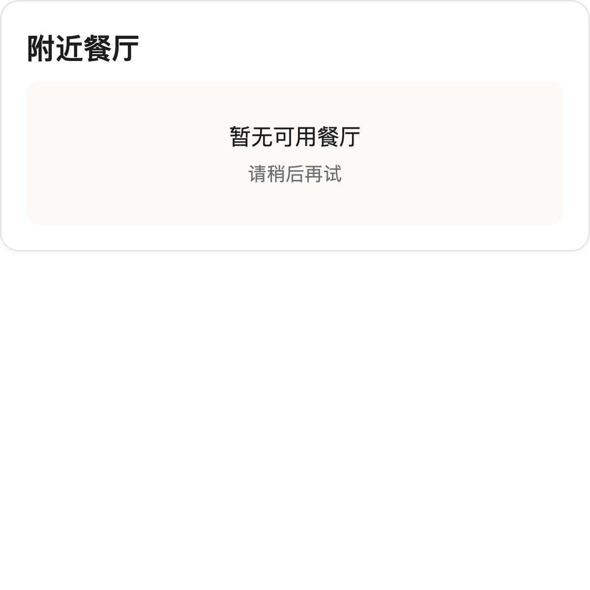
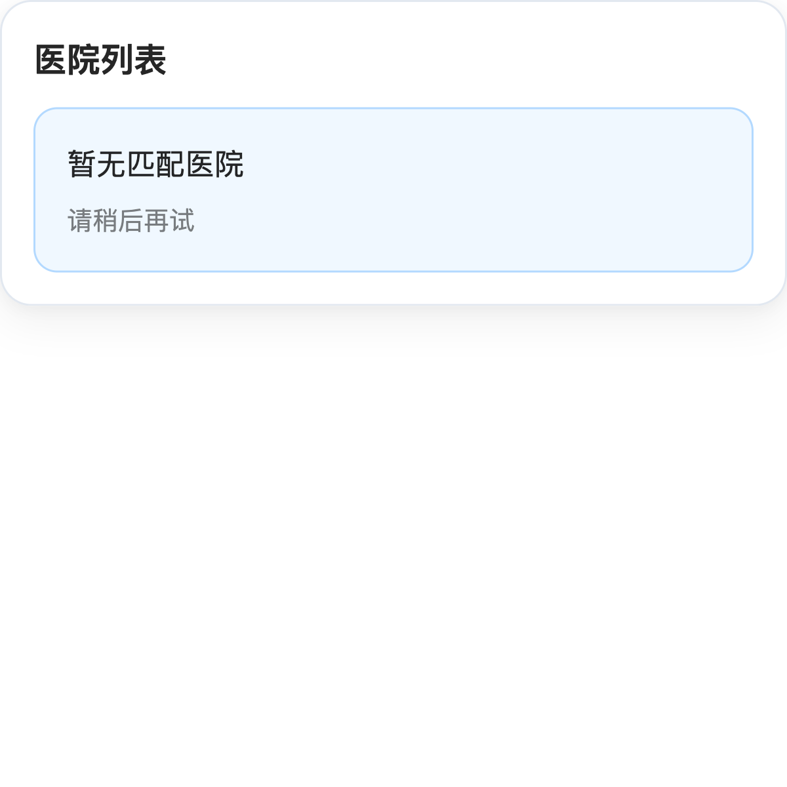
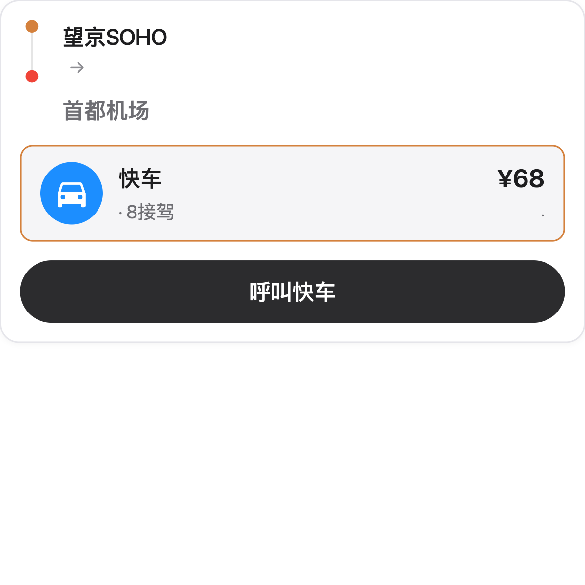
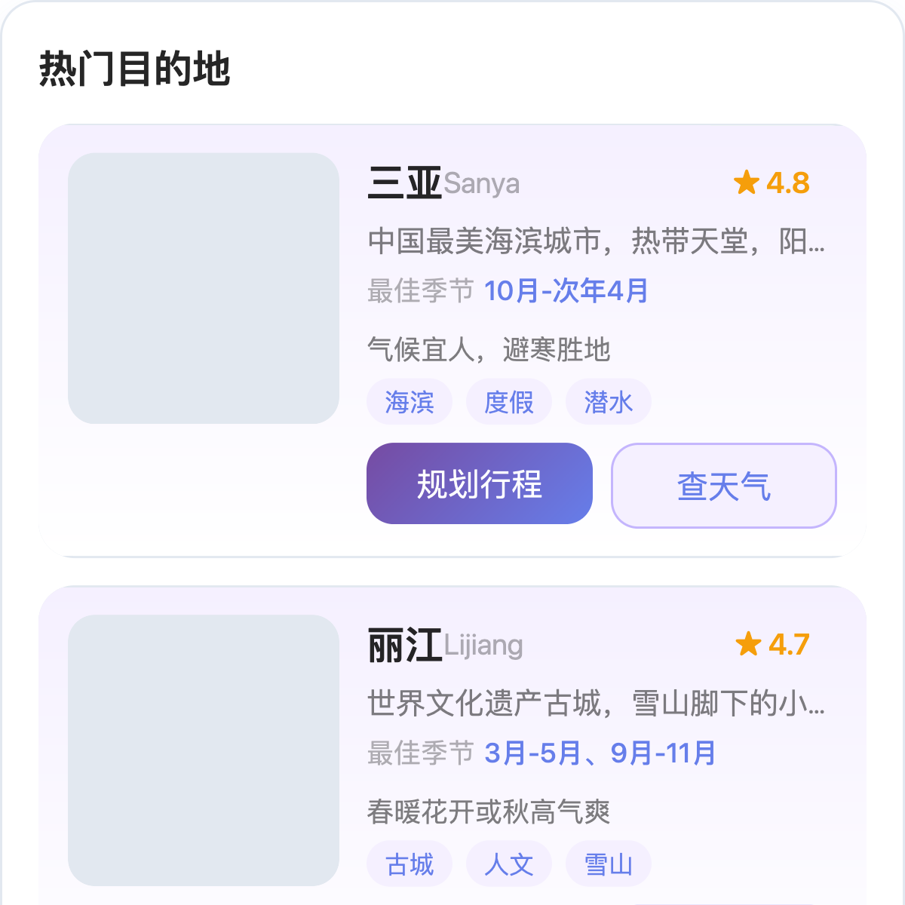
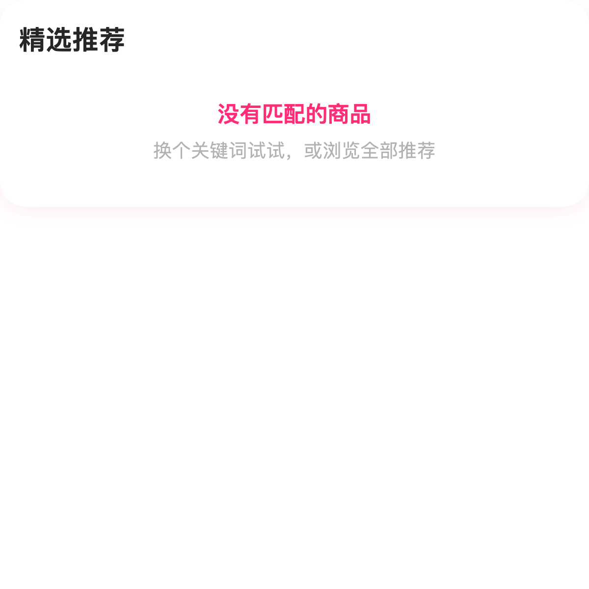
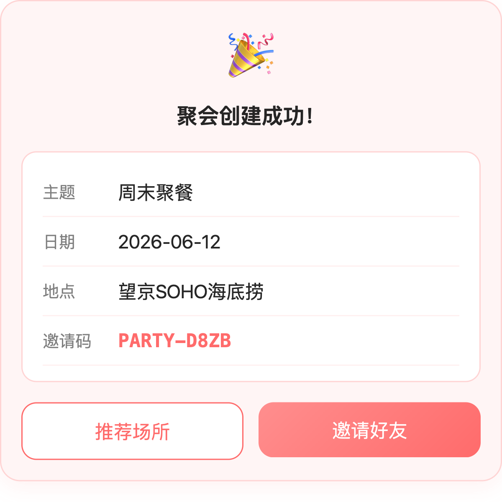
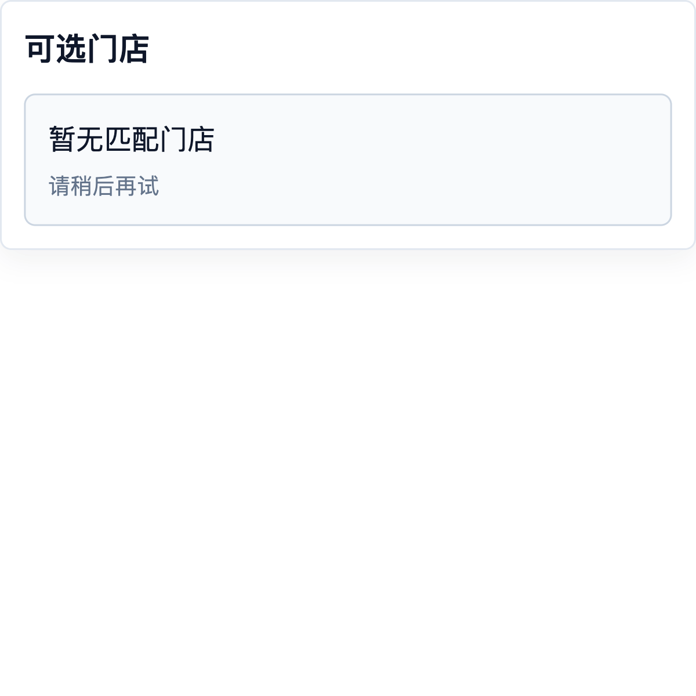
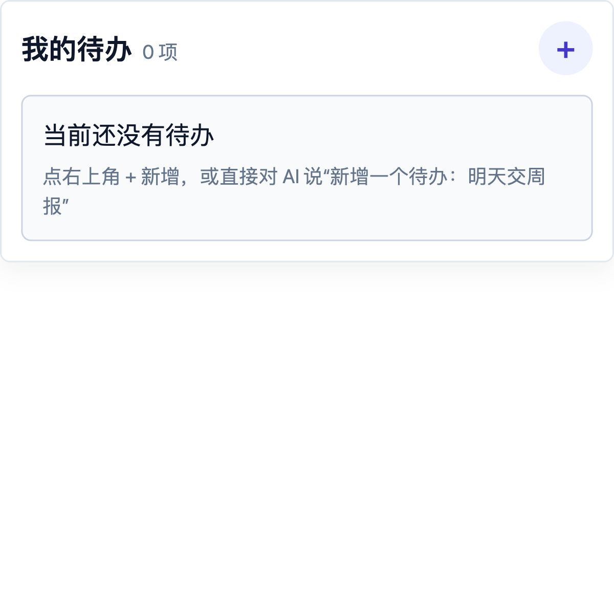
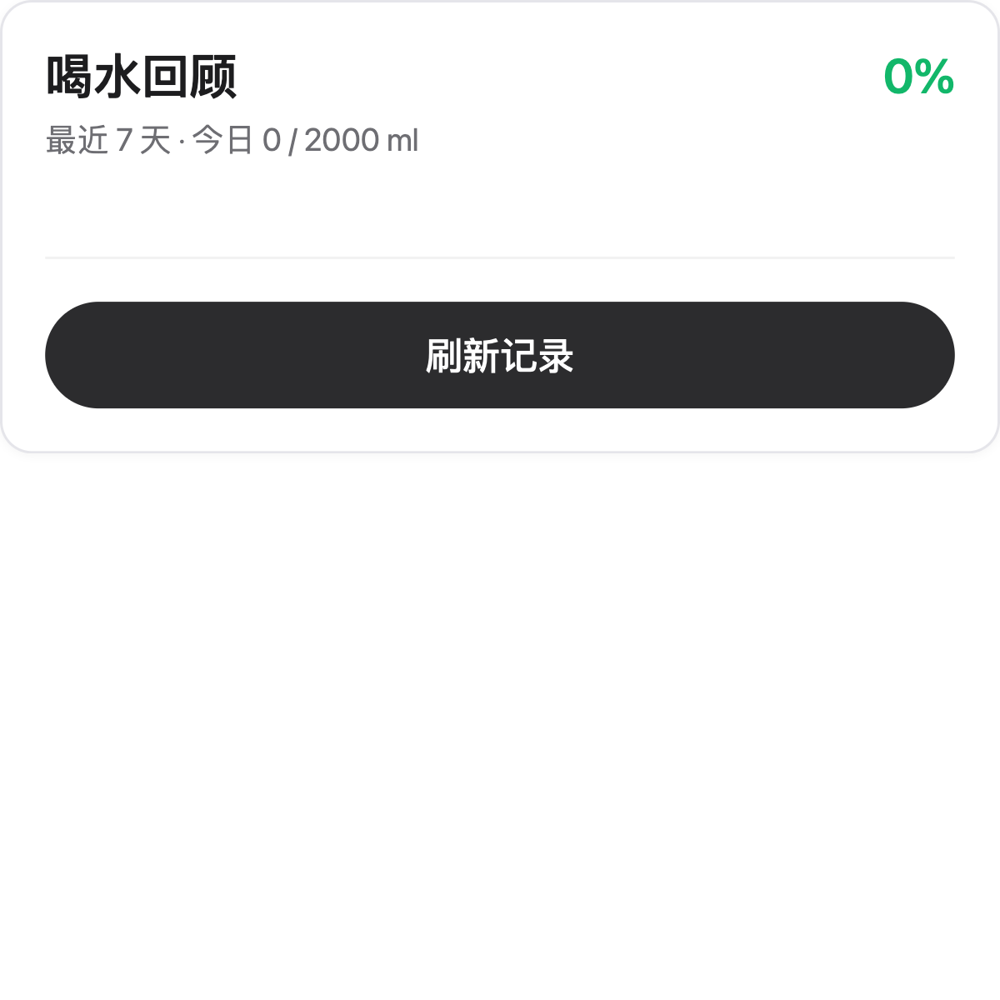
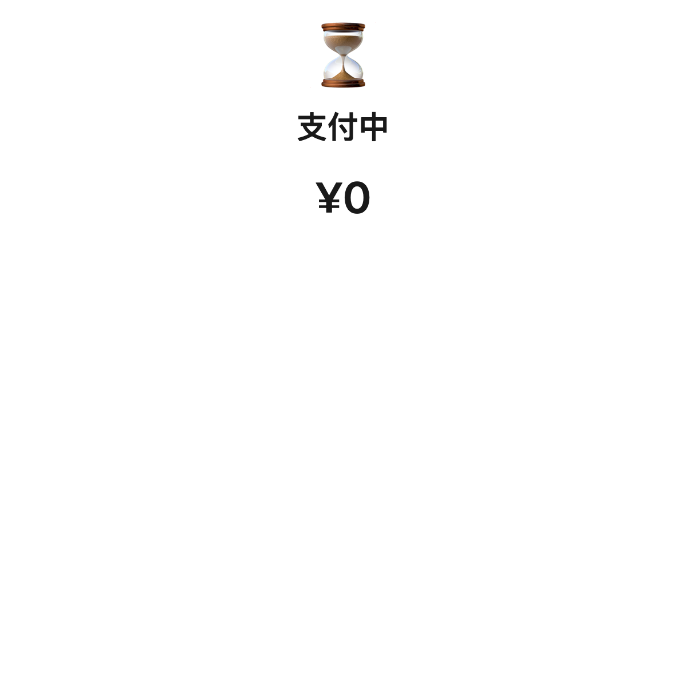

# Awesome WeChat Mini Program Skills

微信小程序 **AI 开发模式** 的 Skill 集合。

> 把小程序业务封装成 AI 可调用的 Skill —— 用户通过自然语言就能完成点单、排队、查天气等操作。
>
> 使用 `mp-skills` CLI 快速将 Skills 接入你的小程序：`npx mp-skills add TencentCloudBase/awesome-miniprogram-skills --list`

## 快速开始

```bash
# 在你的小程序项目中安装 Skill
cd your-miniprogram-project
npx mp-skills add TencentCloudBase/awesome-miniprogram-skills --skill drink-skill

# 或克隆本仓库预览所有 Skill
git clone https://github.com/TencentCloudBase/awesome-miniprogram-skills.git
cd awesome-miniprogram-skills
/Applications/wechatwebdevtools.app/Contents/MacOS/cli open --project .
```

## Skills 一览

| Skill | 描述 | API | 组件 | 截图 |
|-------|------|-----|------|------|
| [drink-skill](skills/drink-skill/README.md) | 咖啡点单 | 10 | 7 |  |
| [order-skill](skills/order-skill/README.md) | 外卖点餐 | 4 | 4 |  |
| [hospital-skill](skills/hospital-skill/README.md) | 医院挂号 | 4 | 4 |  |
| [taxi-skill](skills/taxi-skill/README.md) | 出行打车 | 4 | 4 |  |
| [travel-skill](skills/travel-skill/README.md) | 旅行规划 | 4 | 4 |  |
| [shopping-skill](skills/shopping-skill/README.md) | 潮玩购物 | 4 | 4 |  |
| [bill-skill](skills/bill-skill/README.md) | 生活缴费 | 3 | 3 |  |
| [party-skill](skills/party-skill/README.md) | 聚会安排 | 4 | 4 |  |
| [queue-skill](skills/queue-skill/README.md) | 门店排队取号 | 4 | 4 |  |
| [todolist-skill](skills/todolist-skill/README.md) | 简单待办 | 4 | 1 |  |
| [water-tracker](skills/water-tracker/README.md) | 喝水记录 | 2 | 2 |  |
| [payment-skill](skills/payment-skill/README.md) | 微信支付集成 | 2 | 1 |  |

每个 Skill 的详细说明见各自目录下的 `README.md`。

## 项目架构

```
├── app.json / app.js / app.wxss         # 小程序入口与全局配置
├── pages/home/home                       # 首页（AI Agent 对话入口）
├── page-meta.json                        # 页面元数据（AI 路由）
├── skills/                               # Skill 独立分包（每个自包含）
│   ├── drink-skill/                      # 咖啡点单
│   ├── order-skill/                      # 外卖点餐
│   ├── hospital-skill/                   # 医院挂号
│   ├── taxi-skill/                       # 出行打车
│   ├── travel-skill/                     # 旅行规划
│   ├── shopping-skill/                   # 潮玩购物
│   ├── bill-skill/                       # 生活缴费
│   ├── party-skill/                      # 聚会安排
│   ├── queue-skill/                      # 门店排队取号
│   ├── todolist-skill/                   # 简单待办
│   ├── water-tracker/                    # 喝水记录
│   └── payment-skill/                    # 微信支付
├── cli/                                  # mp-skills CLI 工具
└── assets/screenshots/                   # 组件渲染截图
```

每个 Skill 是自包含的功能单元，包含前端代码（API + 组件）和可选的云函数、数据库集合定义。

## 数据流

```
用户输入 → AI 路由（SKILL.md 匹配）
  → 原子接口（预览模式走 seed mock / 正式模式走云函数）
  → 原子组件（卡片 UI + tap 上行 api/call）
```

所有 Skill 支持双模式运行：
- **预览模式**（默认）：`mp_skills_preview_mode = true`，走本地 seed/mock 数据，无需云开发环境
- **正式模式**：`mp_skills_preview_mode = false`，调用独立云函数，连接云数据库

## Skill 开发范式

详细说明见 [SKILL-DEV-GUIDE.md](SKILL-DEV-GUIDE.md)。

## 贡献

欢迎贡献新的 Skill！请参考 [CONTRIBUTING.md](CONTRIBUTING.md)。

## CLI 工具

使用 `mp-skills` CLI 可以在你的小程序项目中安装和管理 Skill：

```bash
# 全局安装
npm install -g mp-skills

# 查看可用 Skill
mp-skills find

# 搜索 Skill
mp-skills find 咖啡

# 安装 Skill 到当前项目
mp-skills add TencentCloudBase/awesome-miniprogram-skills --skill drink-skill

# 详细文档见 cli/README.md
```

## 本地开发

```bash
# 微信开发者工具打开项目
/Applications/wechatwebdevtools.app/Contents/MacOS/cli open --project /path/to/project

# 静态校验
node ~/.codebuddy/skills/wxa-skills-validate/scripts/validate.mjs <project-path>

# 原子接口执行
node ~/.codebuddy/skills/wxa-skills-validate/scripts/execute.mjs --project <project-path> --name createPayment --args '{"orderId":"TEST001","totalAmount":32.9}'

# 原子组件渲染
node ~/.codebuddy/skills/wxa-skills-validate/scripts/render.mjs --project <project-path> --from-execute <execute-result.json>
```

## 许可证

MIT
