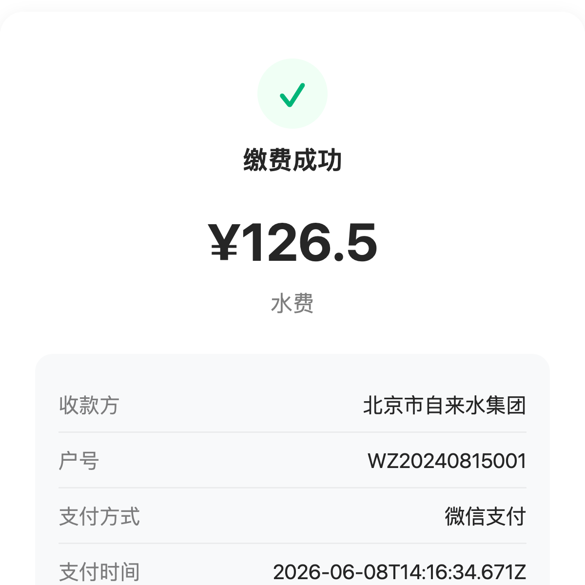
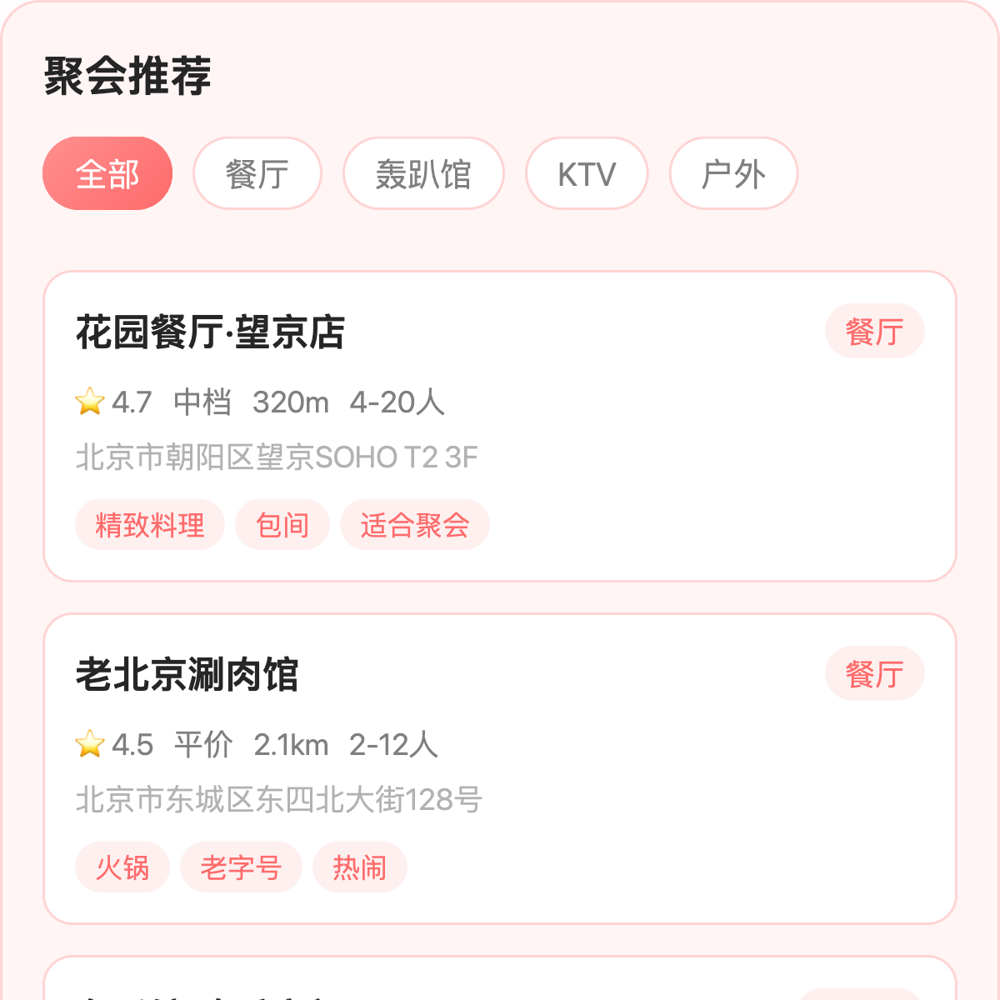

# WeStoreCafe 小程序 AI Demo

基于微信小程序 AI 开发模式（`wx.modelContext`）构建的微信 Agent 生活服务场景演示项目。AI 通过自然语言对话与原子卡片交互，帮用户完成外卖点餐、医院挂号、出行打车、旅行规划、潮玩购物、生活缴费、聚会安排等日常操作。

---

## 项目架构

```
├── app.json / app.js / app.wxss         # 小程序入口与全局配置
├── pages/home/home                       # 首页（AI Agent 对话入口）
├── page-meta.json                        # 页面元数据（AI 路由）
├── cloudfunctions/ai-handler/            # 云函数统一入口
├── skills/                               # 10 个 Skill 独立分包
│   ├── drink-skill/                      # 咖啡点单（原有示例）
│   ├── queue-skill/                      # 门店排队取号（原有示例）
│   ├── todolist-skill/                   # 简单待办（原有示例）
│   ├── order-skill/                      # 🆕 外卖点餐
│   ├── hospital-skill/                   # 🆕 医院挂号
│   ├── taxi-skill/                       # 🆕 出行打车
│   ├── travel-skill/                     # 🆕 旅行规划
│   ├── shopping-skill/                   # 🆕 潮玩购物
│   ├── bill-skill/                       # 🆕 生活缴费
│   └── party-skill/                      # 🆕 聚会安排
└── cli-agent-run/                        # CLI 验证产物与截图
```

每个 Skill 遵循相同的目录结构：

```
skills/{skill-name}/
├── mcp.json          # API 契约（inputSchema / outputSchema / 组件绑定）
├── SKILL.md          # 路由说明（5 节：能力域 → 触发场景 → 不适用范围 → 前置条件 → 使用顺序）
├── index.js          # 注册入口（createSkill + middleware + registerAPI）
├── apis/             # 原子接口实现
├── components/       # 原子组件（WXML / WXSS / JS / JSON）
├── data/seed.js      # Mock 种子数据（云函数降级 fallback）
└── utils/util.js     # 工具函数（云初始化 / 返回值工厂）
```

## 数据流

```
用户语音/文字输入
    ↓
小程序 AI 路由 → SKILL.md 匹配
    ↓
原子接口执行 → try { wx.cloud.callFunction } catch → seed.js mock 数据
    ↓
原子组件渲染 → 卡片 UI（含 tap 上行 text + api/call）
```

---

## 7 个新 Skill 详情

### 1. 外卖点餐 `skills/order-skill/`

**设计风格**：美团橙 `#FF6B35` / 浅橙底 `#FFF5F0`

| 接口 | 功能 | 组件 | 截图 |
|------|------|------|------|
| `searchRestaurants` | 搜索附近餐厅 | restaurant-list-card |  |
| `getMenuItems` | 查看餐厅菜单与菜品 | menu-list-card | — |
| `placeOrder` | 下单（选菜品+地址+支付） | order-confirm-card | — |
| `getOrderStatus` | 查询订单配送状态 | order-status-card | — |

**业务流程**：搜索餐厅 → 浏览菜单 → 下单确认 → 查看配送状态

**种子数据**：7 家餐厅（麦香基、麻辣诱惑、兰州拉面、港式茶餐厅、粥公粥婆、日式拉面、沙拉轻食），每家 4-6 道菜品

---

### 2. 医院挂号 `skills/hospital-skill/`

**设计风格**：iOS 蓝 `#007AFF` / 淡蓝底 `#F0F8FF`

| 接口 | 功能 | 组件 | 截图 |
|------|------|------|------|
| `searchHospitals` | 搜索医院/科室 | hospital-list-card |  |
| `getAvailableSlots` | 查看可挂号时段 | slot-list-card | — |
| `bookAppointment` | 预约挂号 | booking-result-card | — |
| `getMyAppointments` | 查看我的挂号记录 | appointment-list-card | — |

**业务流程**：搜索医院 → 选择科室时段 → 预约挂号 → 查看挂号记录

**种子数据**：5 家三甲/二甲医院，每个科室 3-6 个可用时段，3 条模拟挂号记录

---

### 3. 出行打车 `skills/taxi-skill/`

**设计风格**：滴滴蓝 `#1C8EFF` / 淡蓝底 `#F0F8FF`

| 接口 | 功能 | 组件 | 截图 |
|------|------|------|------|
| `estimateTrip` | 预估行程价格与时长 | trip-estimate-card |  |
| `callTaxi` | 呼叫出租车 | calling-taxi-card |  |
| `getTripStatus` | 查看行程状态 | trip-status-card | — |
| `getTripHistory` | 查看历史行程 | trip-history-card | — |

**业务流程**：输入出发地/目的地 → 查看各车型价格 → 叫车 → 查看行程状态

**种子数据**：5 个北京常用目的地，3 种车型（快车/专车/拼车），3 条历史行程

---

### 4. 旅行规划 `skills/travel-skill/`

**设计风格**：蓝紫渐变 `#667EEA` / 淡紫底 `#F5F0FF`

| 接口 | 功能 | 组件 | 截图 |
|------|------|------|------|
| `searchDestinations` | 搜索旅行目的地 | destination-list-card |  |
| `planTrip` | 规划行程（交通+住宿） | trip-plan-card | — |
| `getWeatherInfo` | 查询目的地天气 | weather-card | — |
| `getTravelTips` | 获取旅行贴士 | tips-card | — |

**业务流程**：搜索目的地 → 查看行程方案 → 查天气 → 获取贴士

**种子数据**：6 个热门目的地（三亚/丽江/成都/杭州/大理/厦门），每个含交通方案+酒店+天气

---

### 5. 潮玩购物 `skills/shopping-skill/`

**设计风格**：潮玩粉 `#FF2D78` / 淡粉底 `#FFF0F5`

| 接口 | 功能 | 组件 | 截图 |
|------|------|------|------|
| `searchProducts` | 搜索潮玩商品 | product-list-card |  |
| `getProductDetail` | 查看商品详情 | product-detail-card | — |
| `checkStoreStock` | 查询门店库存 | stock-check-card | — |
| `placeOrder` | 下单购买 | order-success-card | — |

**业务流程**：搜索潮玩 → 查看详情 → 查库存 → 下单购买

**种子数据**：8 款潮玩商品（Molly/SP/DIMOO/LABUBU 盲盒、手办、周边），3 家线下门店

---

### 6. 生活缴费 `skills/bill-skill/`

**设计风格**：支付绿 `#00B578` / 淡绿底 `#F0FFF5`

| 接口 | 功能 | 组件 | 截图 |
|------|------|------|------|
| `getBills` | 查询待缴账单 | bill-list-card |  |
| `payBill` | 缴费支付 | pay-result-card |  |
| `getPaymentHistory` | 查询缴费历史 | history-card | — |

**业务流程**：查看待缴账单 → 缴费 → 查看历史记录

**种子数据**：5 条待缴账单（水/电/燃气/话费/物业），3 条历史记录

---

### 7. 聚会安排 `skills/party-skill/`

**设计风格**：珊瑚红 `#FF6B6B` / 淡粉底 `#FFF5F5`

| 接口 | 功能 | 组件 | 截图 |
|------|------|------|------|
| `createParty` | 创建聚会活动 | party-create-card |  |
| `getRecommendations` | 获取聚会推荐（餐厅/场地） | recommend-card |  |
| `inviteFriends` | 邀请朋友 | invite-card | — |
| `getPartyDetails` | 查看聚会详情 | party-detail-card | — |

**业务流程**：获取推荐 → 创建聚会 → 邀请好友 → 查看详情

**种子数据**：6 条推荐（餐厅/轰趴馆/KTV/户外），5 个好友，2 条聚会详情

---

## 验证结果

| Skill | 接口 | execute | render | 截图 |
|-------|------|---------|--------|------|
| **order-skill** | searchRestaurants | ✅ | ✅ | ✅ |
| | getMenuItems | ✅ | ✅ | ✅ |
| | placeOrder | ✅ | ✅ | ✅ |
| | getOrderStatus | ✅ | ✅ | ✅ |
| **hospital-skill** | searchHospitals | ✅ | ✅ | ✅ |
| | getAvailableSlots | ✅ | ✅ | ✅ |
| | bookAppointment | ✅ | ✅ | ✅ |
| | getMyAppointments | ✅ | ✅ | ✅ |
| **taxi-skill** | estimateTrip | ✅ | ✅ | ✅ |
| | callTaxi | ✅ | ✅ | ✅ |
| | getTripStatus | ✅ | ✅ | ✅ |
| | getTripHistory | ✅ | ✅ | ✅ |
| **travel-skill** | searchDestinations | ✅ | ✅ | ✅ |
| | planTrip | ✅ | ✅ | ✅ |
| | getWeatherInfo | ✅ | ✅ | ✅ |
| | getTravelTips | ✅ | ✅ | ✅ |
| **shopping-skill** | searchProducts | ✅ | ✅ | ✅ |
| | getProductDetail | ✅ | ✅ | ✅ |
| | checkStoreStock | ✅ | ✅ | ✅ |
| | placeOrder | ✅ | ✅ | — |
| **bill-skill** | getBills | ✅ | ✅ | ✅ |
| | payBill | ✅ | ✅ | ✅ |
| | getPaymentHistory | ✅ | ✅ | ✅ |
| **party-skill** | createParty | ✅ | ✅ | ✅ |
| | getRecommendations | ✅ | ✅ | ✅ |
| | inviteFriends | ✅ | ✅ | ✅ |
| | getPartyDetails | ✅ | ✅ | ✅ |

## 设计原则

所有新 Skill 遵循苹果式现代美学：

- **大圆角**：卡片 16px，按钮 12px
- **柔和阴影**：`0 2px 8px rgba(0,0,0,0.04), 0 8px 24px rgba(0,0,0,0.06)`
- **字体层级**：标题 17px 字重 600 / 正文 15px / 注释 13px
- **文字色阶**：主文 `rgba(0,0,0,0.85)` / 次要 `0.50` / 辅助 `0.30`
- **暗黑模式**：所有组件通过 `@media (prefers-color-scheme: dark)` 支持

每个 Skill 有独立的品牌色系，逼近真实应用场景的视觉风格。

## 云开发资源

- **云环境 ID**：`cloud1-5g39elugeec5ba0f`
- **云函数**：`ai-handler`（统一入口，按 `event.action` 分发）
- **数据库集合**：每个 Skill 对应一个集合（`orders`、`appointments`、`trips`、`travel_plans`、`products`、`bills`、`parties`）

所有接口都实现了"先调云函数 → 失败降级到 seed 数据"的双模式，未开通云开发时依然可用。

## 开发

```bash
# 安装依赖
npm install

# 使用微信开发者工具打开项目
/Applications/wechatwebdevtools.app/Contents/MacOS/cli open --project /path/to/project

# 静态校验
node /path/to/wxa-skills-validate/scripts/validate.mjs <project-path>

# 原子接口执行
node /path/to/wxa-skills-validate/scripts/execute.mjs --project <project-path> --name <api-name> --auto-port 9420

# 原子组件渲染
node /path/to/wxa-skills-validate/scripts/render.mjs --project <project-path> --from-execute <execute-result.json> --auto-port 9420
```
